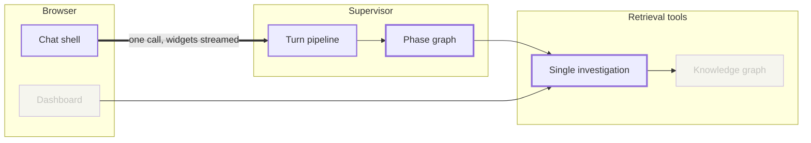
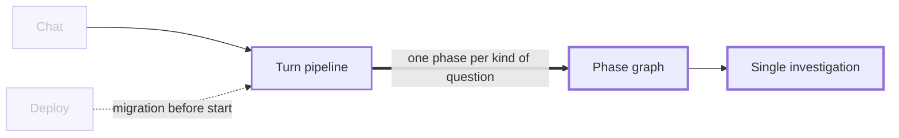

# Shapes for a dossier

One map for the whole change; then per domain its own map **and** its own before/after shape. Smallest view that carries the point; a shape needing a paragraph of explanation is the wrong shape. Keep the neighbours that did **not** change - a picture of only the changed nodes says nothing about blast radius - and use real names and real numbers, or the shape is decoration.

## The map, once, after the plain-words list

Lanes are the reader's mental model - a runtime, a tier, a trust boundary - never the folder tree. Twelve nodes at the outside. Mark the one edge the change is really about. Mermaid renders natively on GitHub, GitLab and Azure DevOps.



Faded nodes are untouched and prove the reach; a deleted node a reader would still look for stays, labelled removed. `graph` is a reserved word: never use it as a node id.

## The per-domain map

Same grammar as the big map, scoped down: this domain's pieces, the neighbours that call in and the ones it calls out, unchanged ones included, at most ten nodes. It answers where the domain sits; the shape below answers what runs differently. Reuse the node names from the big map so the reader keeps one vocabulary.



## Per-domain shapes, in order of preference

**Control flow**, when the change is a decision; **call tree**, when it is who calls what. Keep the unchanged steps:

```diff
 handle_turn
-  pick specialist by heuristic score
+  bind operator scope from the page catalogue
+  XMateOrchestrator.run -> typed phase (analytics | execution | troubleshooting)
+    xmate_investigate           # one call, was four
   stream_consumer
+  if the phase needs the operator: pause, persist, resume on answer
```

**File tree**, when the change is where responsibility now lives - shallow, comments say what each owns:

```diff
 analytics/
-├── _analytics_tools.py   # 2,239 lines: routing, queries, cards
+├── engine/               # query planning
+├── domains/              # one file per data domain
+└── insights/             # cards and KPI tiles
```

**Component tree**, for a UI change - state and boundaries that matter, real path on the root: `<AiChat> (…/ai-chat.ts)` / `useChatRuntime()` / `+ <AnswerProvenance/>` / `<ChatTimeline>` / `+ <KpiTiles/>`, in a `diff` fence.

**Sequence** (`sequenceDiagram`), only when ordering across boundaries is the point and no tree shows it; one flow beats three thin ones.

## Rules

- Unchanged neighbours stay in: faded on the map, a leading space in a `diff` fence.
- A domain map shares nodes with the big map - that is the point - but two domain maps must not be the same picture retitled, and no shape repeats another's nodes.
- No findings in a shape - no severity, no bug, no security note. This is the comprehension layer; `review` owns defects.
- No folder tree presented as architecture, and no level added because the previous one existed: system context, then containers, then a component view only when an affected container's internals matter.

Distilled from humanlayer/skills `show-me` (view catalogue, diff-shaped views) and coldtea `pr-lens` (lanes, hero edge, unchanged neighbours, no findings lens, C4-inspired view choice).
